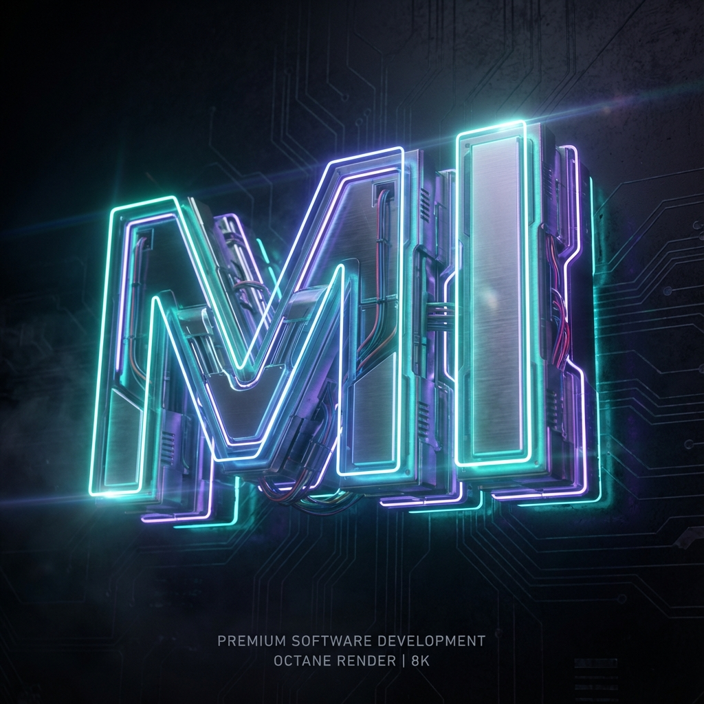

# Professional Angular Portfolio

A modern, scalable, and high-performance personal portfolio website built with **Angular v21** and **Tailwind CSS v4**. Designed to be easily customizable, data-driven, and future-proof.



## 🚀 Features

- **Data-Driven Architecture**: All content (Skills, Projects, Experience, Tech Stack) is managed via a central data file (`src/app/shared/data.ts`).
- **Dynamic Styling System**: Fully customizable color themes for projects and skills defined directly in data—no HTML changes required.
- **Modern Design**: Sleek, mobile-first responsive UI utilizing **Tailwind CSS** with glassmorphism effects and smooth gradients.
- **Dark/Light Mode**: Fully supported theme switching with system preference detection and local storage persistence.
- **Optimized Performance**:
  - **Core Web Vitals**: Optimized for LCP and CLS using `NgOptimizedImage` and font preloading.
  - **Animations**: Smooth scroll-triggered animations using **AOS** (Animate On Scroll) and typical Angular control flow keyframe animations.
- **Components**:
  - **Dynamic Footer & Header**: Responsive navigation with mobile menu and copyright handling.
  - **Scroll-To-Top**: Auto-appearing navigation aid.
  - **Custom 404**: Styled "Page Not Found" handling.
- **SEO Friendly**: Dynamic meta tags, Open Graph support, and semantic HTML structure.
- **Contact Form**: Integrated with **EmailJS** for direct email delivery with validation and feedback states.

## 🛠️ Tech Stack

- **Framework**: Angular 21 (Standalone Components, Signals, @if/@for Control Flow)
- **Styling**: Tailwind CSS, Material Symbols, Devicon
- **Animations**: AOS, CSS Transitions
- **Deployment**: Netlify (Configured with `netlify.toml`)

## 📦 Installation & Setup

1. **Clone the repository**:

   ```bash
   git clone https://github.com/matin676/Portfolio-Angular.git
   cd Portfolio-Angular
   ```

2. **Install dependencies**:

   ```bash
   npm install
   ```

3. **Start the development server**:

   ```bash
   ng serve
   ```

   Navigate to `http://localhost:4200/`. The application will automatically reload if you change any of the source files.

4. **Build for production**:

   ```bash
   ng build
   ```

   The build artifacts will be stored in the `dist/portfolio` directory.

## ⚙️ Customization Guide

### 1. Updating Content & Styling

You **do not** need to edit HTML files to add projects or change their colors.
Open `src/app/shared/data.ts`. This file contains all the dynamic data and styling configuration.

**Example - Adding a new Project with Custom Colors:**

```typescript
export const PROJECTS: Project[] = [
  // ... existing projects
  {
    title: 'New Project Name',
    description: 'Description of your awesome project.',
    tags: ['Angular', 'TypeScript'],
    icon: 'code',
    links: {
      github: 'https://github.com/...',
      demo: 'https://demo-link.com',
    },
    // Define exact Tailwind classes for the look you want
    style: {
      iconBg: 'bg-gradient-to-br from-red-600 to-red-400 shadow-red-500/25',
      buttonBg: 'bg-red-600 hover:bg-red-700 shadow-red-600/25',
      titleHover: 'group-hover:text-red-600 dark:group-hover:text-red-400',
      text: 'text-red-600 dark:text-red-400',
    },
  },
];
```

### 2. Configuring Contact Form

The contact form uses **EmailJS**. To make it functional:

1. Sign up at [EmailJS](https://www.emailjs.com/).
2. Create a Service and a Template.
3. Set your environment variables (e.g., in a `.env` file or your deployment platform's environment variables settings).
4. The application uses `scripts/set-env.js` to automatically generate `src/environments/environment.ts` based on these variables.

## 🚀 Deployment

This project is optimized for deployment on **Netlify**.

1. Push your code to GitHub.
2. Log in to [Netlify](https://www.netlify.com/).
3. **Add new site** > **Import an existing project** > **GitHub**.
4. Select your repository.
5. Netlify will automatically detect the settings from `netlify.toml`.
6. **Deploy!**

_Note: A `netlify.toml` file is included to handle build commands and routing rules._

## 📄 License

This project is open source and available under the [MIT License](LICENSE).
